# Vegan Minecraft Datapack

This is a Minecraft Datapack that adds a few features to Minecraft, allowing for a more vegan experience. It provides a few alternative crafting recipes to substitute animal-based ingredients with plant-based ones.

## Downloads
*A list of all downloads is available at the [GitHub releases overview](https://github.com/Wendelstein7/Vegan-Minecraft/releases).*

### Minecraft 1.19

Latest version for **Minecraft 1.19** is **`v1.1`** - Download: **[vegan-minecraft-v1.1-mc1.19.zip](https://github.com/Wendelstein7/Vegan-Minecraft/releases/download/v1.1/vegan-minecraft-v1.1-mc1.19.zip)**

### Minecraft 1.18.2
Latest version for **Minecraft 1.18.2** is **`v1.1`** - Download: **[vegan-minecraft-v1.1-mc1.18.2.zip](https://github.com/Wendelstein7/Vegan-Minecraft/releases/download/v1.1/vegan-minecraft-v1.1-mc1.18.2.zip)**

### Minecraft 1.17.1
Latest version for **Minecraft 1.17.1** is **`v1.1`** - Download: **[vegan-minecraft-v1.1-mc1.17.1.zip](https://github.com/Wendelstein7/Vegan-Minecraft/releases/download/v1.1/vegan-minecraft-v1.1-mc1.17.1.zip)**


# Guide
How to obtain vegan items in Minecraft with this datapack:

## [Feather](datapack/data/vegan/recipes/feather.json)
You can craft vegan feathers using **sticks** and **strings**.

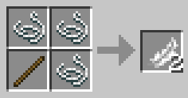


## [String](datapack/data/vegan/recipes/string.json)
You can craft vegan strings using **wheat**.

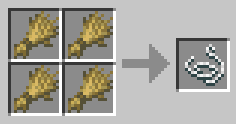


## [Ink sac](datapack/data/vegan/recipes/ink_sac.json)
You can craft vegan ink sacs using **clay** and **coal**.

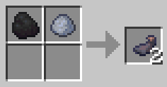


## [Glow ink sac](datapack/data/vegan/recipes/glow_ink_sac.json)
You can craft vegan glow ink sacs using **ink sacs**, **glowstone** and **redstone**.

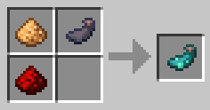


## [Gunpowder](datapack/data/vegan/recipes/gunpowder.json)
You can craft vegan gunpowder using **sugar**, **wheat** and **coal**.

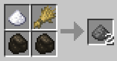


## [Slime Ball](datapack/data/vegan/recipes/slime_ball.json)
You can craft vegan slime balls using **clay** and **vines**.

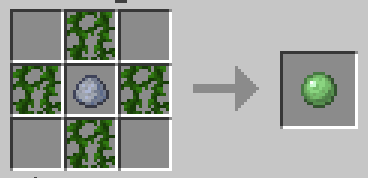


## [Leather](datapack/data/vegan/recipes/leather.json)
You can craft vegan leather by roasting **lily pads** on a **campfire**. First, craft a campfire:

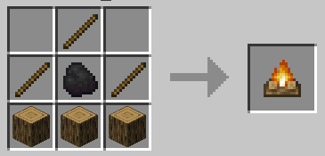

Then, place the campfire and right click on the campfire with lily pads to place them. They will now be roasted.

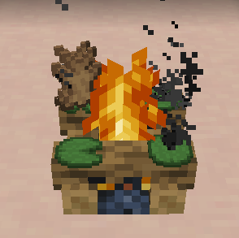

After a few moments, you will get "rabbit" hides. Combine four of those into a vegan leather piece.

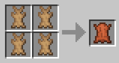


## [Bonemeal](#)
You can get vegan bonemeal by using the vanilla **composer** block. Place various plant-like materials in it by right clicking the composter. When the composter is full enough, the block will show white spots. You can then right click the composter to retrieve the bonemeal or compost.

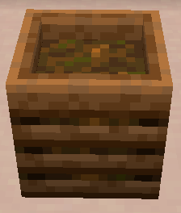


## [Honey Bottle](datapack/data/vegan/recipes/honey_bottle.json)
You can craft vegan honey bottles (egg replacer) using **sugar**, **orange dye** and **water bottles**.

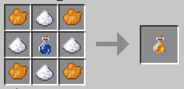


## [Ghast Tear](datapack/data/vegan/recipes/ghast_tear.json)
You can craft vegan ghast tears using **glow ink sacs**, **fire charges**, **nether quartz**, **glowstone dust** and **blaze powder**.

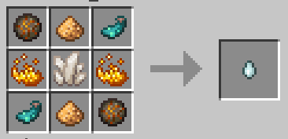


## [Blaze Powder](datapack/data/vegan/recipes/blaze_powder.json)
You can craft vegan blaze powder using **gunpowder**, **gold nuggets**, **nether wart** and **glowstone dust**.

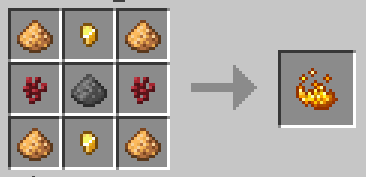


## [Blaze Rod](datapack/data/vegan/recipes/blaze_rod.json)
You can craft vegan blaze rods using **sticks**, **blaze powder** and **gold nuggets**.

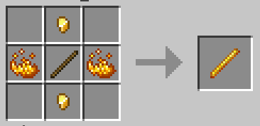


## [Cake](datapack/data/vegan/recipes/cake.json)
You can craft vegan cakes using **milk buckets**, **wheat**, **sugar** and **honey bottles**.

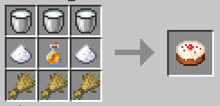


## [Pumpkin Pie](datapack/data/vegan/recipes/pumpkin_pie.json)
You can craft vegan pumpkin pies using **pumpkins**, **sugar** and **honey bottles**.

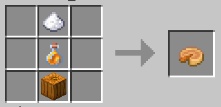


## [Ender Pearl](datapack/data/vegan/recipes/ender_pearl_crafting.json)
You can craft or blast vegan ender pearls using **chorus fruit**.


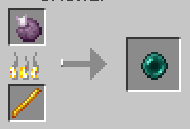

_(Note that this can be done only in a **blasting furnace**. Blaze rod is not required.)_

# Changelog

### Version 1.1
- Added recipes for `ender pearl`, `honey bottle`, `ghast tear`, `pumpkin pie`, `cake`, `blaze rod`, `blaze powder` and `milk buckets`.
- Fixed recipe unlocking, now works properly.

Credits and gratitude to [@ACascarino](https://github.com/ACascarino) and the [vegcraft](https://github.com/ACascarino/vegcraft) datapack for inspiration for these changes! `ACascarino/vegcraft` is licenced under the [MIT license](https://github.com/ACascarino/vegcraft/blob/develop/LICENSE).

### Version 1.0
First public release, containing basic recipes for the following items: `feather`, `string`, `ink sac`, `glow ink sac`, `gunpowder`, `slime ball` and `leather`. 

# Development

The contents of the datapack are located in the [datapack](./datapack/) folder. Simply zip the contents of this folder...

```bash
(cd datapack && zip -FS -9 -r ./../vegan-minecraft.zip .)
```

...and put the zip file in the 'datapacks' folder of a Minecraft save.

It can then be enabled via the following command inside Minecraft:

```minecraft
/datapack enable "file/vegan-minecraft.zip"
```